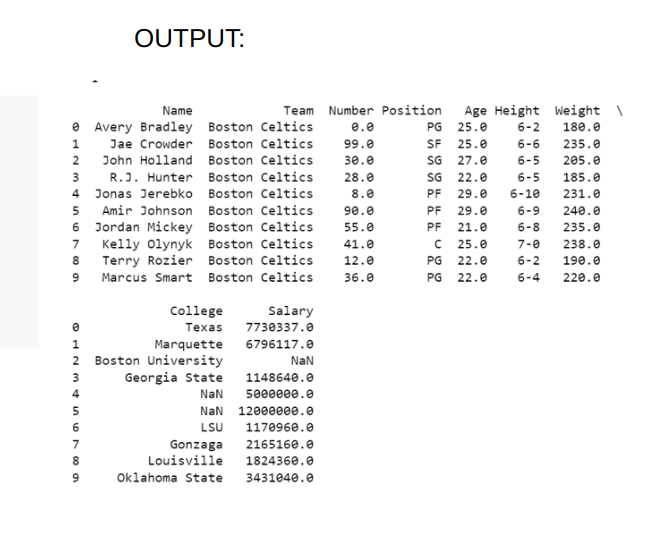

# Read-from-CSV

## AIM:
To write a program to read a file from csv in python programming.

## ALGORITHM:
### Step 1:
Create a file.
### Step 2:
Write a code.
### Step 3:
Python file and csv file should be in same file.
### Step 4:
Execute the code.
### Step 5:
Verify the output.

## PROGRAM:
```python
'''
Developed by: Vishnupriya R
Reference number: 22006962
'''
import pandas as pd
f=pd.read.csv('/content/nba.csv')
print(f.head(10))
print(f.tail())
print('Row:',len(f.axes[0]))
print('Col:',len(f.axes[1]))
```

## OUTPUT:


## RESULT:
Thus the program is written to read a file from csv using python programming.
